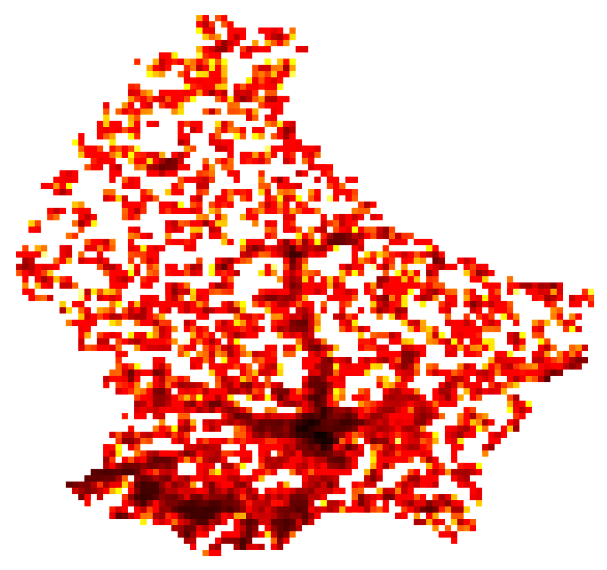
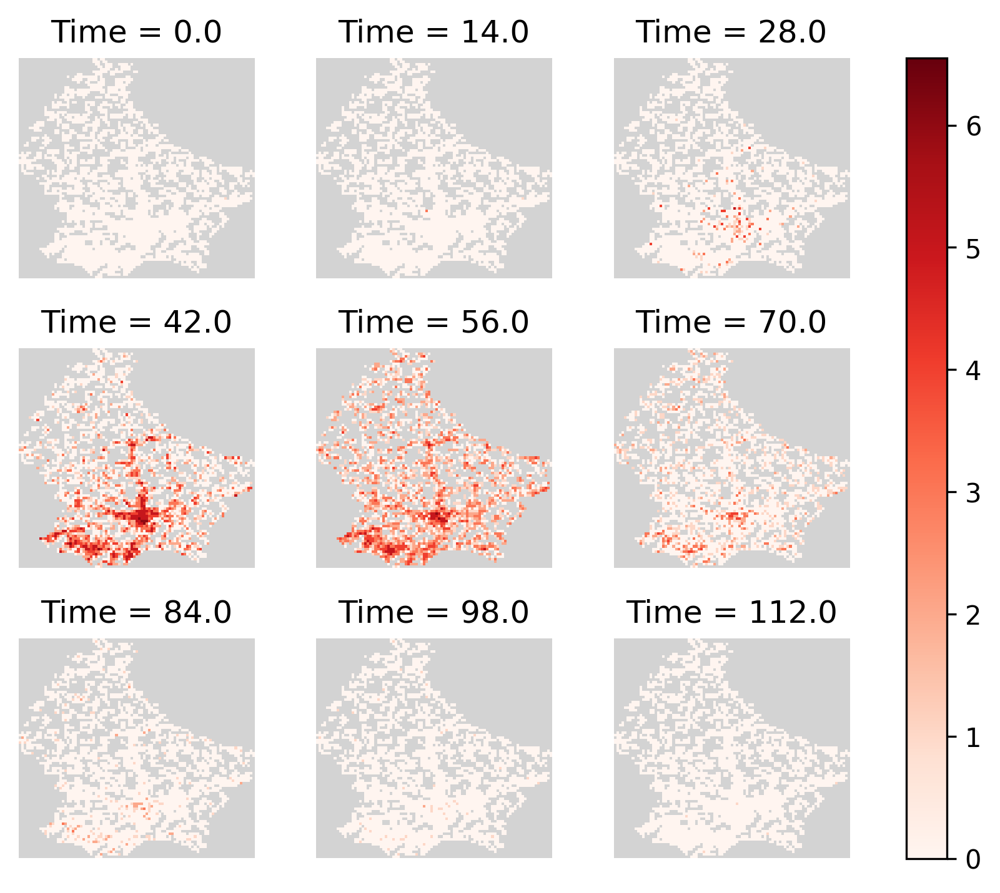
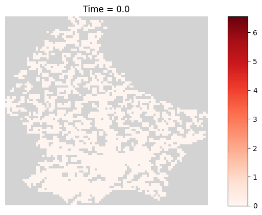

# EpiGeoPop

[](https://doi.org/10.5281/zenodo.14112520)

This repository is a snakemake workflow for getting population density data for arbitrary countries.
It uses population data from the [JRC Big Data Analytics Platform](https://jeodpp.jrc.ec.europa.eu/ftp/jrc-opendata/GHSL/GHS_POP_MT_GLOBE_R2019A/GHS_POP_E2015_GLOBE_R2019A_4326_30ss/V1-0/), border data from [Natural Earth](https://www.naturalearthdata.com/downloads/10m-cultural-vectors/), and is partially based on Adam Symington's [excellent blog post](https://towardsdatascience.com/creating-beautiful-population-density-maps-with-python-fcdd84035e06).
This workflow is motivated by extending [epiabm](https://github.com/SABS-R3-Epidemiology/epiabm) to other countries.

The workflow generates population density files that look like:



and can generate figures of simulations like:



or animations like:



## Running

There are two parts to EpiGeoPop:

1. A Snakemake pipeline which creates population density files to be fed into an epidemiological simulation
2. A script to process simulation outputs and generate visualizations

The generated input files and expected output files for EpiGeoPop are based on epiabm.
Briefly, the generated input files are CSVs which contain the following fields:

* **cell:** The cell index for a particular tile
* **microcell:** The microcell index within a cell
* **location_x:** The longitude of the cell
* **location_y:** The latitude of the cell
* **household_number:** The number of households in the microcell
* **place_numer:** The number of non-residential places in the microcell
* **Susceptible:** The number of (initially susceptible) people in the microcell

For more information about these files, including a desciption of microcells, etc., please refer to the epiabm repository here https://github.com/SABS-R3-Epidemiology/epiabm.

### Creating simulation inputs

The following shows how to setup and run the Snakemake pipeline.
By default, it will create the files for running a Luxembourg simulation, but the `Snakefile` can be modified to generated files for many countries, province/states, or cities.

Clone the repository

```
git clone git@github.com:SABS-R3-Epidemiology/EpiGeoPop.git
cd EpiGeoPop
```

Create virtual environment (recommended)

```
python -m venv venv
source venv/bin/activate
```

Install dependencies

```
pip install -r requirements.txt
```

Downlaod the raw data (See `data/README.md` for more information)

```
bash prep.sh
```

Run the snakemake pipeline

```
snakemake --cores 1
```

#### Exploring the data

Check the `outputs` directory for example population density maps.
The image `outputs/dag.svg` shows the entire workflow.
The file `data/processed/countries/Luxembourg_microcells.csv` contains the generated microcells, used for input to simulations such as epiabm.
The file `data/processed/countries/Luxembourg_pop_dist.json` contains the age distribution of populations.

#### Running on other regions

The Snakefile contains commented out examples of other regions to show how to generate files for other countries, provinces, and cities.
These also require a configuration file to determine factors like the age distribution of the population.
Boiler plate configurations can be copied from similar files in the `configs` directory.

## Generating animations

The file `make_gif.py` in `data/sim_outputs` is used for making GIFs and grids from simulation output data.
To use it, add the simulation output file to `data/sim_outputs`, and run `python make_gif.py -f [filename].csv`.
The resulating animation and grid of time snapshots will be stored in `data/sim_outputs/animation`.
An example on Winnipeg (Canada) is provided in this repository and can be run with `python make_gif.py -f output_winnipeg.csv` within the `data/sim_outputs` directory.

Additional optional arguments (--duration (to control the time per frame in milliseconds, default 100 ms), and --dpi (to set the image resolution, default 300 dpi)) can be provided when running the script, for example: `python make_gif.py -f output_winnipeg.csv --duration 100 --dpi 300`.
